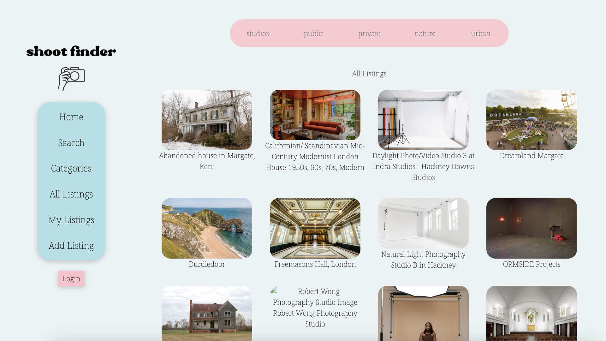
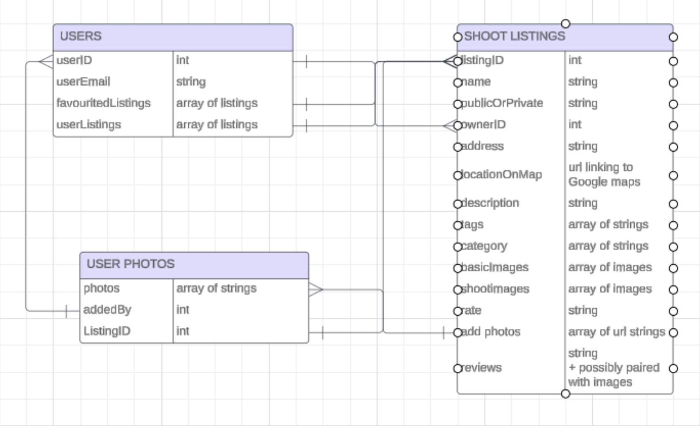
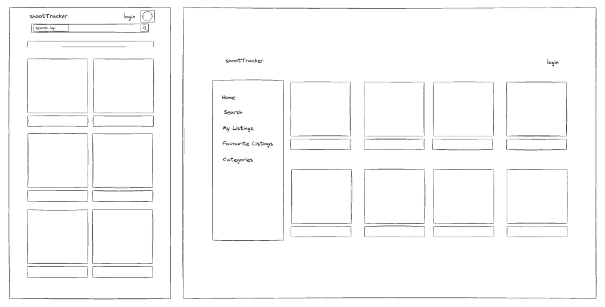
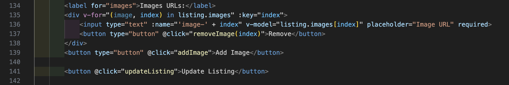
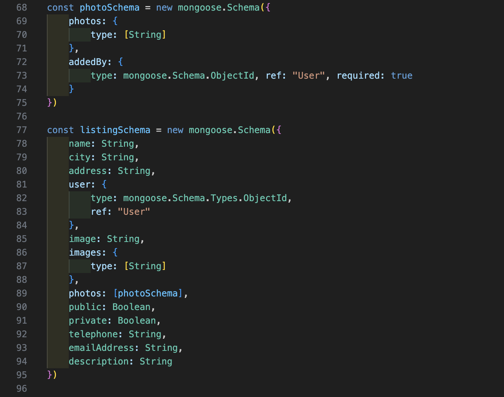
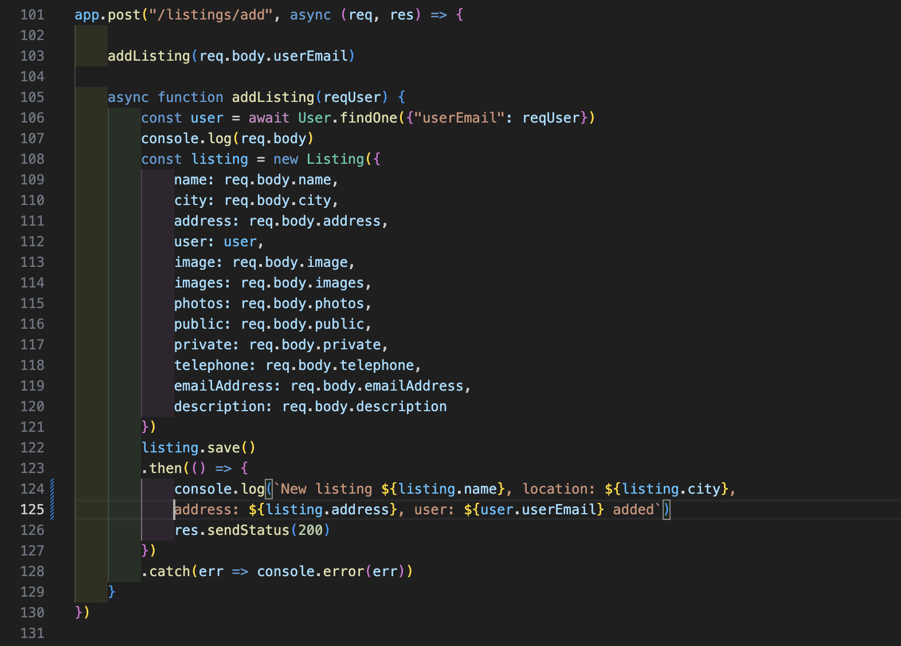
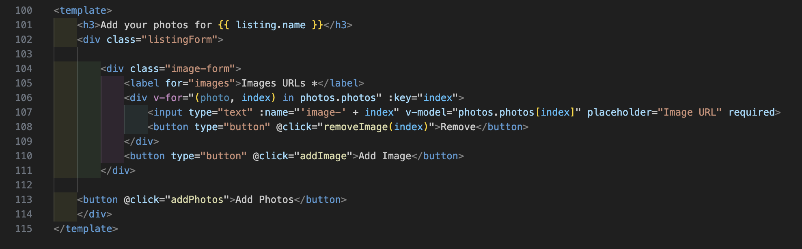

# Project Two - Shoot Finder
Table of Contents:
+ Project Overview
+ Deployment Link
+ Getting Started/ Code Installation
+ Timeframe & Working Team
+ Technologies Used
+ The Brief
+ Planning
+ Build Process
+ Challenges
+ Wins
+ Key Learnings
+ Bugs
+ Future Improvements

## Project Overview

### Project 2: Shoot Finder



Shoot Finder is an online community where users can view and post their own private photoshoot locations, as well as flag public / nature locations. 

Users can add examples of their own photoshoot images to a guest image gallery for each listing, as well as search for listings by keywords, location and category.

This is my first experience creating a full stack application using MongoDB, Express, Vue.js, Node and Google OAuth.

## Find the completed project here: [Shoot Finder](https://shoot-finder.netlify.app/)

## Getting Started/ Code Installation

[GitHub Front End](https://github.com/JoelleLi/Unit2_Project_FrontEnd)

[GitHub Back End](https://github.com/JoelleLi/Unit2_Project_BackEnd)

Clone / download the repo.

In terminal, run the following commands:

+ Install dependencies ```npm i```
+ Start back-end server using ```nodemon```
+ Navigate into front-end folder ```cd frontend```
+ Run the front-end server using ```npm run dev```

## Timeframe & Working Team

Timeframe was one week independently.

## Technologies Used

*Backend*
+ MongoDB
+ Express
+ Node
+ JavaScript

*Frontend*
+ Vue.js
+ JavaScript
+ HTML 
+ CSS

*Development Tools*
+ VS Code
+ LucidChart
+ Google Chrome Dev Tools
+ Git
+ GitHub
+ npm
+ Netlify (deployment)

## Brief

+ **Build a Node/Express/MongoDB full stack application** from the ground up.
+ The app must **have at least 2 data entities** (data resources) in addition to the `User` Model - one entity that represents the main functional idea for your app and another with a One:Many or Many:Many relationship with that main entity (embedded or referenced).
+ The app must use **OAuth authentication**.
+ **Implement basic authorization that restricts access to features** that need a logged in user in order to work (typically CUD data operations) by "protecting" those routes from anonymous users using the `ensureLoggedIn` middleware from the OAuth lesson.  
+ In addition, **ensure that editing and deletion of a data resource can only be done by the user that created that data** (this is done in the controller - refer to the Guide to User-Centric CRUD).
+ **Have full-CRUD data operations** somewhere within the app's features. 
Deploy the app online.

## Planning

To start, I began by looking at similar websites to my idea and noting down the types of data collection and presentation they used. In this case the main comparison which had most similarities to what I wanted to do was Airbnb. In this case images were an important part of each listing, as well as location.

Then I created a Data modelling diagram using Lucidchart with the data types I wanted to do and the relationships they would have with each other. 



I then did a rough layout of how I wanted my app to look like and how I would like the data to be displayed. 



## Build/Code Process

### Day 1 

I began by setting up the initial schemas with only basic data types, so that I could first cement a foundation that would CRUD. Initially I created two schemas, listingSchema and userSchema. I then planned to build on top of that and make the data models more advanced once I’d got it to work. 

I then set up a basic front end interface with a rough idea of the paths and different page views I wanted to use.

### Day 2

Once I had established basic CRUD functions and was able to create, read, update and delete on the front and back end, including users only being able to delete and edit their own listings whilst logged in with Google, I began to add more key values to my “listings” data model.

I added a simple Google map display on each listing, using the address key value in the listing data model to display this.

I also added a way to add, edit and delete multiple photos in a listing in the front end. I did this by looping through each image and displaying a button and input field for each one in the HTML.



I then added a boolean key value, “public” and “private”, to the listings data model. On the front end, the user creating and editing the listing could tick either or both “public” and “private”.

Then, I created a page with categories in which the user could view listings by city or whether they were public or private.

### Day 3

I  added a third data model, photoSchema, a nested data object inside the listingSchema. In this I wanted users, including users who were not the original creator of the listing, to be able to post their own examples of photos from past shoots to the listing so they could be displayed in a user photo gallery on the front end. 

This was quite an important element as I felt the core functionality of my concept was that it would be quite community based and dependent on users being able to share their own experiences.



In the back end I then created the function which would add the images to the associated listing.



### Day 4

I worked on the front end functionality of users being able to post their own photos on other user’s listings.



I also began to work on CSS and styling using Bootstrap grid.

## Challenges

I found it quite difficult using CSS alongside Bootstrap due to the nature of Bootstrap to override a lot of things. I found this part very challenging as styling and looks is very important to me and I found it really hard to make the app look professional.

I mainly found my third data model, photoSchema, difficult to initialise and create CRUD function for due to it being a nested data model inside another data model. 
This required a lot of trial and error and help from tutors to access the key value pairs inside it.

I also found that due to the functionality taking me a long time to implement, I didn’t have enough time to look into other elements I wanted to have such as a search function to search listings by name and tags, and a photo carousel on each listing rather than having images statically displayed on each listing.

I at first wanted to implement a search bar in the navigation header at the top of the app, so it would always be present no matter what page you are on.

However, even though the same code worked on another separate page, I could not get it to work in the nav bar. There were no error messages to help me to figure out why, and it’s a feature I’d like to look into in the future.

## Wins

In terms of CRUD functionality I managed to get the basic CRUD functions working in a good time, with the ability to create, read, update and delete running quite smoothly.

I found the initial switch from using pure vanilla JavaScript to using the Vue.js language and format extremely challenging, especially with the utilising of many files in front and back end folders. This project involved doing a lot of side research and learning as I was working on the app. Considering this is my first ever full stack application I was able to manage my time well to make sure I got all the minimum requirements done.

## Key Learnings/Takeaways

I learnt a lot about Bootstrap classes and general styling and CSS methods, and has made me more determined to develop on these skills and become more practised at CSS.

## Bugs

In the user image gallery, there is only the ability to delete the whole array of images that a user has posted, and not individually.

## Future Improvements

This project is still a work in progress and I would still like to add search functionality so the user can search for a listing by name and keywords/ tags. I would also like to make the display of images more clean and functional with a photo carousel on each listing.

I would also like to develop the styling and CSS so the app has more of an identity and professionalism to it, and most importantly I need to make the site mobile responsive.

It would be great to develop the community driven aspect of the app, with adding the ability for users to favourite listings, leave reviews, and send messages on the app.

Also, the user image gallery functionality needs a lot more work. Currently if a user posts multiple images and then wants to delete a single image, the whole set of images are deleted.
As I did not get round to using a third party API in this project, I would like to implement this in some way in the future. 

